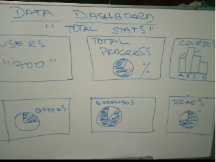
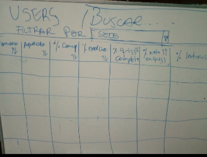
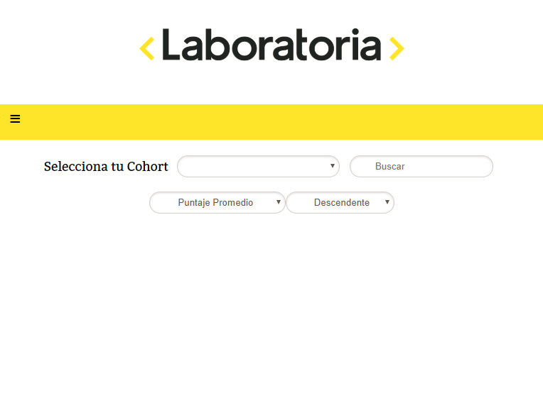
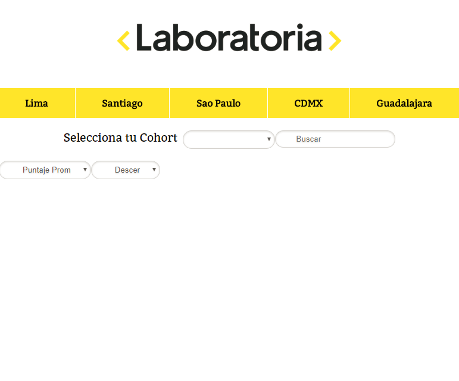
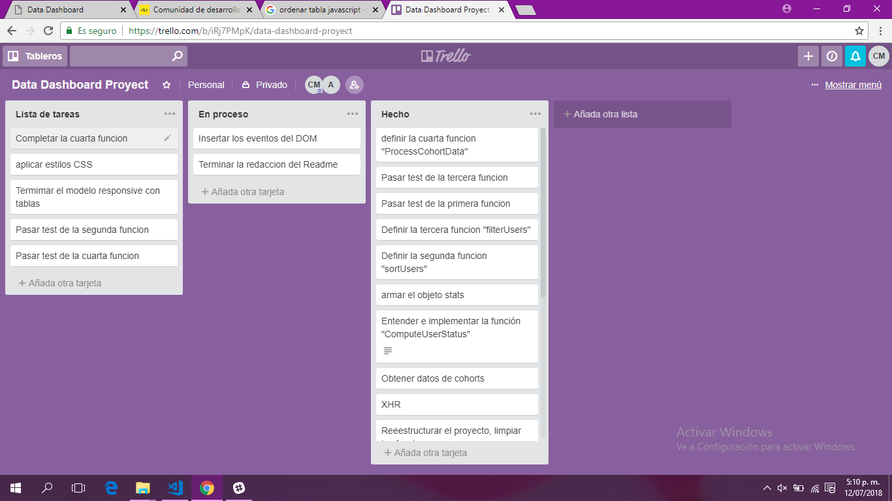

# Data Dashboard para Laboratoria version 3.0 16/07/2018

## Descripcion general

Nuestro producto esta completamente enfocado en las necesidades y dificultades que tienen los Training Managers y Jedis para acceder a los progresos de las alumnas en la plataforma del LMS.
Tuvimos conocimiento que las TMs ya habian tenido una forma de ver los datos del LMS, sin embargo el programa era muy pesado y le perdian interesa muy facilmente.
Con esta problematica, desarrollamos una plataforma que muestra el avance y desarrollo de cada una de las alumnas de una determinada sede y cohort.

## Nuestro proceso de diseño
1. Primera Idea. 
  Salio escribiendo conforme releiamos el readme, desmenuzabamos los conceptos para darnos una idea de lo requerido.

  
    

2. Boceto en blanco y negro.
  Desarrollamos nuestra primera idea al terminar de leer el readme; con los datos que rescatamos hicimos un boceto en photoshop ya que para mi compañera era mas facil trabajar en esta aplicacion. Salimos a buscar feedback, nuestra TM Ale nos indico que debiamos centrarnos mas en las estudiantes de lima, que no era necesario la comparacion entre alumnas ya que en las distintas sedes estaban en momentos diferentes del bootcamp, y que era mas factible ver el progreso de las alumnas en general para poder compararlas con un determinado nivel esperado y, si en caso estaban por debajo, apoyarlas en su aprendizaje.

    
    
    

3.User Experience Design. 
Al mostrarle el boceto a nuestro cliente (TM Alejandra), nos dio a conocer sus necesidades en cuanto a la plataforma, las cuales nos hicieron cambiar de opinion y replantear la vision que teniamos que era mas global por algo mas especifico. Ademas, nos señalo que no era necesario la comparacion entre alumnas ya que en las distintas sedes estaban en momentos diferentes del bootcamp, y que era mas factible ver el progreso de las alumnas en general para poder compararlas con un determinado nivel esperado y, si en caso estaban por debajo, apoyarlas en su aprendizaje.

4. Segundo boceto en Figma.
  Desarrollamos el segundo boceto en la plataforma Figma, porque se pueden visualizar los logos e imagenes con mejor calidad. Apuntando a como queriamos que quedara nuestro producto final.

    
    
    
    

5. Producto Final.
 Por ultimo, el resultado final es una sintesis de lo planteado en un comienzo con las necesidades que fueron surgiendo en el camino.

 
 

## Requisitos basicos de la aplicacion

En los navegadores Internet Explorer y Opera Mini no se puede visualizar la informacion al 100% ya que la plataforma tiene caracteristicas no soportadas en estos.

Debes entrar a la carpeta `src/` y seleccionar el archivo `indexinit.html` para visualizar la interfaz.

## Archivos incluidos

Al descargar la carpeta tendras acceso a estos archivos:  
```text
./
├── .editorconfig
├── .eslintrc
├── .gitignore
├── images
├── README.md
├── data
│   ├── cohorts
│   │   └── lim-2018-03-pre-core-pw
│   │       ├── progress.json
│   │       └── users.json
│   └── cohorts.json
├── package.json
├── src
│   ├── data.js
│   ├── indexinit.html
│   ├── indexco.html
│   ├── styleco.css
│   ├── main.js
│   └── styleinit.css
└── test
    ├── data.spec.js
    ├── fixtures.js
    ├── headless.js
    └── index.html
```


## Como nos organizamos

Creamos un trello que nos ayude a organizar nuestras tareas.

  

Con la ayuda de esta herramienta decidimos, como primer paso, conceptualizarnos y practicar ejercicios de los metodos y propiedades que nos tocaba utilizar en este proyecto.
Con estos conocimientos empezamos a desarrollar el proyecto, sin embargo tuvimos algunas lagunas conceptuales que nos llevaron a
replantear nuestro proyecto desde 0.
Con esta decision tomada, avanzamos juntas haciendo peer-programing, algo totalmente nuevo que no hicimos desde el comienzo; pero nos dimos cuenta que si funcionaba y que nos beneficiaba.
Desarrollamos la 1ra función juntas y para acelerar el trabajo, nos repartimos la 2da y la 3ra función.
Los tests los pasamos conforme fuimos terminando las funciones.
Terminamos con un diseño diferente, pero contentas con el resultado y con los conocimientos aprendidos. 

### La Interfaz de Usuario (HTML/CSS/JS)

Luego de diseñar tu interfaz de usuario deberás trabajar en su implementación.
Como mencionamos, **no** es necesario que construyas la interfaz tal como la
diseñaste. Tendrás un tiempo limitado para hackear, así es que deberás priorizar.

Como mínimo, tu implementación debe:

1. Permitir al usuario seleccionar un cohort de una lista de cohorts.
2. Al seleccionar un cohort:
   - Listar las estudiantes de ese cohort
   - Para cada estudiante:
     + Calcular porcentaje de completitud de todos los _cursos_.
     + Calcular grado de completitud de _lecturas_, _ejercicios autocorregidos_,
       y _quizzes_.
   - Ordenar estudiantes por completitud _general_ (porcentaje consufhmido/completado
     de todos los cursos del cohort en cuestión), de _lecturas_, _ejercicios
     autocorregidos_ y _quizzes_.
   - Filtrar/buscar estudiantes por nombre.
3. Visualizarse sin problemas desde distintos tamaños de pantallas: móviles,
   tablets y desktops.
4. Incluir pruebas unitarias.

Es importante que tu interfaz, a pesar de ser una versión mínima de tu ideal,
igual debe seguir los fundamentos de visual design, como: contraste,
alineación, jerarquía, entre otros.

## Detalles de Implementación

### data.js

El corazón de este proyecto es la manipulación de datos a través de arreglos y
objetos. La idea de este archivo es contener toda la funcionalidad
que corresponda a obtener, procesar y manipular datos.

Parte de un buen proyecto es que esté ordenado y que otras programadoras puedan
acceder a el código rápidamente. Es por esto que este orden no es casualidad y
es una convención que generalmente encontrarás en internet bajo el nombre MVC o
Modelo Vista Controlador. En este proyecto Controlador y Modelo estarán bajo
el archivo **data.js**.

El _boilerplate_ incluye tests que esperan que implementes las
siguientes 4 funciones y las _exportes_ al entorno global (`window`) dentro del
script `src/data.js`, ten en cuenta que esto es solo lo básico, si necesitas más
funciones puedes hacerlo:

#### 1) `computeUsersStats(users, progress, courses)`

Esta función es la responsable de "crear" la lista de usuarios (estudiantes)
que vamos a "pintar" en la pantalla. La idea es "recorrer" el arreglo de
usuarios (`users`) y calcular los indicadores necesarios de progreso para cada
uno. La función debe devolver un nuevo arreglo de usuarios donde a cada objeto
de usuario se le debe agregar una _propiedad_ con el nombre `stats` con las
estadísticas calculadas.

##### Argumentos

* `users`: Arreglo de objetos obtenido de la data en bruto.
* `progress`: Objeto de progreso en bruto. Contiene una llave para cada usuario
  (`uid`) con un objeto que contiene el progreso del usuario para cada curso.
* `courses`: Arreglo de _strings_ con los _ids_ de los cursos del cohort en
  cuestión. Esta data se puede extraer de la propiedad `coursesIndex` de los
  objetos que representan los _cohorts_.

##### Valor de retorno

Un arreglo de objetos `usersWithStats` con la propiedad `stats`, la cual debe ser un
objeto con las siguientes propiedades:

* `percent`: Número entero entre 0 y 100 que indica el porcentaje de completitud
  general del usuario con respecto a todos los cursos asignados a su cohort.
* `exercises`: Objeto con tres propiedades:
  - `total`: Número total de ejercicios autocorregidos presentes en cursos del
    cohort.
  - `completed`: Número de ejercicios autocorregidos completados por el usuario.
  - `percent`: Porcentaje de ejercicios autocorregidos completados.
* `reads`: Objeto con tres propiedades:
  - `total`: Número total de lecturas presentes en cursos del cohort.
  - `completed`: Número de lecturas completadas por el usuario.
  - `percent`: Porcentaje de lecturas completadas.
* `quizzes`: Objeto con cinco propiedades:
  - `total`: Número total de quizzes presentes en cursos del cohort.
  - `completed`: Número de quizzes completadas por el usuario.
  - `percent`: Porcentaje de quizzes completadas.
  - `scoreSum`: Suma de todas las puntuaciones (score) de los quizzes
    completados.
  - `scoreAvg`: Promedio de puntuaciones en quizzes completados.

#### 2) `sortUsers(users, orderBy, orderDirection)`

La función `sortUsers()` se encarga de _ordenar_ la lista de usuarios creada con
`computeUsersStats()` en base a `orderBy` y `orderDirection`.

##### Argumentos

* `users`: Arreglo de objetos creado con `computeUsersStats()`.
* `orderBy`: String que indica el criterio de ordenado. Debe permitir ordenar
  por nombre, porcentaje de completitud total, porcentaje de ejercicios
  autocorregidos completados, porcentaje de quizzes completados, puntuación
  promedio en quizzes completados, y porcentaje de lecturas completadas.
* `orderDirection`: La dirección en la que queremos ordenar. Posibles valores:
  `ASC` y `DESC` (ascendiente y descendiente).

##### Valor de retorno

Arreglo de usuarios ordenado.

#### 3) `filterUsers(users, search)`

##### Argumentos

* `users`: Arreglo de objetos creado con `computeUsersStats()`.
* `search`: String de búsqueda.

##### Valor de retorno

Nuevo arreglo de usuarios incluyendo solo aquellos que cumplan la condición de
filtrado, es decir, aquellos que contengan el string _search_ en el nombre
(`name`) del usuario.

#### 4) `processCohortData(options)`

Esta función es la que deberíamos usar al seleccionar un cohort y cada vez que
el usuario cambia los criterios de ordenado y filtrado en la interfaz. Esta
función debe invocar internamente a `computeUsersStats()`, `sortUsers()` y
`filterUsers()`.

##### Argumentos

* `options`: Un objeto con las siguientes propiedades:
  - `cohort`: Objeto cohort (de la lista de cohorts)
  - `cohortData`: Objeto con dos propiedades:
    + `users`: Arreglo de usuarios miembros del cohort.
    + `progress`: Objeto con data de progreso de cada usuario en el contexto de
      un cohort en particular.
  - `orderBy`: String con criterio de ordenado (ver `sortUsers`).
  - `orderDirection`: String con dirección de ordenado (ver `sortUsers`).
  - `search`: String de búsqueda (ver `filterUsers`)

##### Valor de retorno

Nuevo arreglo de usuarios _ordenado_ y _filtrado_ con la propiedad `stats`
añadida (ver `computeUsersStats`).

### main.js

Ten en cuenta también que existe otro archivo _main.js_ que no está solo por
casualidad en la estructura del proyecto. En general es una buena idea ir
separando la funcionalidad en varios archivos, ya que a medida que un proyecto
crece, se vuelve insostenible dejar todo en un solo archivo. En este caso puedes
usar _main.js_ para todo tu código que tenga que ver con mostrar los datos en la
pantalla, y _data.js_ para todas las funciones que vimos que obtienen y
manipulan los datos.

Esta no es la única forma de dividir tu código, puedes usar más archivos y
carpetas, siempre y cuando la estructura sea clara para tus compañeras.

### index.html

Al igual que en el proyecto anterior, también existe un archivo `index.html`.
Como ya sabrás, acá va la página que se mostrará al usuario de este tablero de
información. También nos sirve para indicar qué scripts se usarán y unir todo lo
que hemos hecho.

### Data

En esta carpeta están los datos de prueba del proyecto, contiene información
sobre los cohorts (grupos de estudiantes de una generación y rama en particular),
estudiantes y su progreso en cada uno de los cursos que son parte de cada cohort.
Para poder usar cada uno de los archivos JSON, puedes ocupar el mismo método que
usarías si es que estuvieses haciendo una llamada HTTP o a una API, pero usando
una dirección **relativa**, ejemplo:

```javascript
"../data/cohorts.json"
```

### Tests

Tendrás también que completar las pruebas unitarias de estas funciones que se
incluyen en el _boilerplate_, que encontrarás en el archivo `data.spec.js`.
Si te fijas bien en la carpeta también encontrarás otros archivos, que
detallaremos a continuación:

#### index.html

No confundas este archivo con tu `index.html` del proyecto, este archivo es
especial para los test y es una manera de ver el resultado de tus pruebas
unitarias, pero en el navegador. Para arrancar las pruebas de esta forma,
escribe en tu consola:

```javascript
npm run test-browser
```

Una página se abrirá en tu navegador conteniendo los resultados de las pruebas.

#### fixtures.js

Muy importante archivo, aunque no siempre estará (depende del proyecto). Acá es
donde está el set de datos de prueba que se usarán para correr las pruebas.

<!-- ### Habilidades blandas

Para completar este proyecto deberás realizar una planificación general del
proyecto, donde esperamos que generes un plan paso a paso de cómo resolverás
el proyecto. Deberás considerar las distintas secciones del data dashboard, los
recursos y el tiempo que dispones.

Para lograrlo, deberás trabajar de manera colaborativa con tu compañera, para
esto tienen que coordinarse en la construcción del producto, viendo de qué
manera quieren trabajar y qué responsabilidades tendrá cada una para que así
cumplan con los tiempos de entrega y ejecución.

Para este proyecto busca instancias de code review, donde deberás buscar
feedback de tu código con otro dupla, para que puedas mejorar el producto.
Mientras más feedback recibas, mejor será su producto.

Nos interesa ver tu capacidad de autoaprendizaje, por lo que esperamos que
logren realizar el hacker edition, de esta manera podrás llevar tu producto al
siguiente nivel.

Para finalizar, deberás presentar su data dashboard al resto del curso, para
esto necesitarás que tu demo tenga acceso desde cualquier computador y que
puedas realizar una presentación que permita a todos comprender lo realizado.
Sabemos que puede ser una instancia difícil, esperamos que logres mostrar su
trabajo y los demás lo comprendan. -->

## Hacker edition

Features/características extra sugeridas:

* En lugar de consumir la data estática brindada en este repositorio, puedes
  consumir la data del [Live API de Laboratoria](https://api.laboratoria.la/).
  Lee la [documentación aquí](https://laboratoria.github.io/api.laboratoria.la/).
* Agregarle a tu interfaz de usuario implementada visualizaciones gráficas.
* Brindar el detalle de progreso de cada estudiante _por curso_
* Proveer estadísticas de progreso de todo el cohort

## Entrega

En este proyecto deberás trabajar colaborativamente. Para ello, una de las integrantes del equipo deberá forkear el repositorio del cohort y la otra integrante **deberá hacer un fork del repositorio de su compañera**. Luego de esto, deberás [configurar](https://help.github.com/articles/configuring-a-remote-for-a-fork/) un `remote` hacia el repositorio del cual hiciste el fork. 

Para mandar cambios desde un repositorio forkeado al original debes crear un [pull request](https://help.github.com/articles/creating-a-pull-request-from-a-fork/) y el propietario del repositorio original recibirá una notificación para [revisar el pull request](https://help.github.com/articles/reviewing-proposed-changes-in-a-pull-request/) y [aceptar los cambios](https://help.github.com/articles/merging-a-pull-request/). 

Aquí algunas recomendaciones para que organices mejor el trabajo con tu compañera:
* En lugar de trabajar en una sola rama o _branch_, puedes organizar el flujo de trabajo con dos ramas principales: 
  * `master`: rama que contiene las funcionalidades terminadas y sin errores.
  * `develop`: rama dónde integrarás las funcionalidades conforme las vayas desarrollando.

* Además de tener las dos ramas anteriores, puedes trabajar cada nueva funcionalidad en una rama individual (_feature branches_), estas ramas en lugar de crearse a partir de `master`, tienen a `develop` como su rama de origen. Cuando una funcionalidad es terminada se integra de nuevo a `develop`. Las _feature branches_ no se deben integrar directamente a `master`.

* Por último, te sugerimos codear usando la técnica de [pair programming](http://www.javiergarzas.com/2012/06/beneficios-pair-programming.html).


¿Quieres saber más forks y pull requests?

* Un [fork](https://help.github.com/articles/fork-a-repo/) es una copia de un repositorio en el que puedes experimentar sin afectar al repositorio original. Generalmente se usa para proponer cambios al proyecto de alguien más o para usar el proyecto de otra persona como punto de partida para una idea que quieras realizar.

* Un [pull request](https://help.github.com/articles/about-pull-requests/) (PR) te permite solicitar la inclusión de cambios al repositorio original (tu punto de partida) en GitHub. Cuando un PR es abierto, este permite solicitar, discutir y revisar los cambios realizados con todos los colaboradores y agregar otros commits antes de que los cambios sean incluidos al repositorio original. 


## Evaluación

Recuerda revisar la [rúbrica](https://docs.google.com/spreadsheets/d/e/2PACX-1vSkQy1waRpQ-16sn7VogiDTy-Fz5e7OSZSYUCiHC_bkLAKYewr4L8pWJ_BG210PeULe-TjLScNQQT_x/pubhtml#)
para ver la descripción detallada de cada _habilidad_ y cada _nivel_. A
continuación presentamos los niveles esperados para cada habilidad:

### General

| Característica/Habilidad | Nivel esperado |
|--------------------------|----------------|
| Completitud | 3
| Investigación | 3
| Documentación | 2

### Tech

| Habilidad | Nivel esperado |
|-----------|----------------|
| **JavaScript** | |
| Estilo | 2
| Nomenclatura/semántica | 3
| Funciones/modularidad | 2
| Estructuras de datos | 2
| Tests | 2
| **HTML** | |
| Validación | 3
| Estilo | 3
| Semántica | 2
| SEO | 0
| **CSS** | |
| DRY | 2
| Responsive | 2
| **SCM** | |
| Git | 3
| GitHub | 2
| **CS** | |
| Lógica | 1
| Arquitectura | 2
| Patrones/paradigmas | 0

### UX

| Habilidad | Nivel esperado |
|-----------|----------------|
| User Centricity | 3 |
| Entrevistas | 2 |
| Contraste | 3 |
| Alineación | 3 |
| Jerarquía | 2 |
| Tipografía | 2 |
| Color | 2 |

### Habilidades Blandas
Esperamos que alcances al menos el nivel 2 en todas tus habilidades blandas.

| Habilidad | Nivel esperado |
|-----------|----------------|
| Planificación y organización | 2
| Autoaprendizaje | 2
| Solución de problemas | 2
| Dar y recibir feedback | 2
| Adaptabilidad | 2
| Trabajo en equipo (trabajo colaborativo y responsabilidad) | 2
| Comunicación eficaz | 2
| Presentaciones | 2

***

## Puntos de experiencia

* Completando los requerimientos mínimos de este proyecto ganarás 250 XPs.
* Completando el hacker edition de este proyecto ganarás 100 XPs adicionales.
* Completando los ejercicios de manipulación de arreglos en el LMS (https://lms.laboratoria.la/cohorts/lim-2018-05-bc-core-pm/courses/javascript/04-arrays/06-practice)
  ganarás otros 25 XPs.
* Completando los ejercicios de manipulación de objetos en el LMS (https://lms.laboratoria.la/cohorts/lim-2018-05-bc-core-pm/courses/javascript/05-objects/06-practice)
  ganarás otros 25 XPs.

## Primeros pasos

1. Antes que nada, asegúrate de tener un :pencil: editor de texto en
  condiciones, algo como [Atom](https://atom.io/) o
  [Code](https://code.visualstudio.com/).
2. Para ejecutar los comandos a continuación necesitarás una :shell:
  [UNIX Shell](https://github.com/Laboratoria/curricula-js/tree/v2.x/topics/shell),
  que es un programita que interpreta líneas de comando (command-line
  interpreter) así como tener [git](https://github.com/Laboratoria/curricula-js/tree/v2.x/topics/scm/01-git)
  instalado. Si usas un sistema operativo "UNIX-like", como GNU/Linux o MacOS,
  ya tienes una _shell_ (terminal) instalada por defecto (y probablemente `git`
  también). Si usas Windows puedes usar [Git bash](https://git-scm.com/download/win),
  aunque recomendaría que consideres probar :penguin: GNU/Linux.
3. Una de las integrantes del equipo debe realizar un :fork_and_knife: [fork](https://help.github.com/articles/fork-a-repo/)
del repo de tu cohort, tus _coaches_ te compartirán un _link_ a un repo. La otra integrante del equipo deber hacer un fork **del repositorio de su compañera** y [configurar](https://gist.github.com/BCasal/026e4c7f5c71418485c1) un `remote` hacia el mismo. 
4. :arrow_down: [Clona](https://help.github.com/articles/cloning-a-repository/)
  tu _fork_ a tu computadora (copia local).
5. 📦 Instala las dependencias del proyecto con el comando `npm
  install`. Esto asume que has instalado [Node.js](https://nodejs.org/) (que
  incluye [npm](https://docs.npmjs.com/)).
6. Si todo ha ido bien, deberías poder ejecutar las :traffic_light:
  pruebas unitarias (unit tests) con el comando `npm test`.
7. A codear se ha dicho! :rocket:

## Tips / Pistas

* [Array en MDN](https://developer.mozilla.org/es/docs/Web/JavaScript/Referencia/Objetos_globales/Array)
* [Array.sort en MDN](https://developer.mozilla.org/es/docs/Web/JavaScript/Referencia/Objetos_globales/Array/sort)
* [Array.map en MDN](https://developer.mozilla.org/es/docs/Web/JavaScript/Referencia/Objetos_globales/Array/map)
* [Array.filter en MDN](https://developer.mozilla.org/es/docs/Web/JavaScript/Referencia/Objetos_globales/Array/filter)
* [Array.reduce en MDN](https://developer.mozilla.org/es/docs/Web/JavaScript/Referencia/Objetos_globales/Array/reduce)
* [Array.forEach en MDN](https://developer.mozilla.org/es/docs/Web/JavaScript/Referencia/Objetos_globales/Array/forEach)
* [Object.keys en MDN](https://developer.mozilla.org/es/docs/Web/JavaScript/Referencia/Objetos_globales/Object/keys)
* [Object.entries en MDN](https://developer.mozilla.org/es/docs/Web/JavaScript/Referencia/Objetos_globales/Object/entries)
* [XMLHttpRequest en MDN](https://developer.mozilla.org/en-US/docs/Web/API/XMLHttpRequest)
* [Fetch API en MDN](https://developer.mozilla.org/en-US/docs/Web/API/Fetch_API)
* [json.org](https://json.org/json-es.html)
* [Postman](https://chrome.google.com/webstore/detail/postman/fhbjgbiflinjbdggehcddcbncdddomop?hl=en)